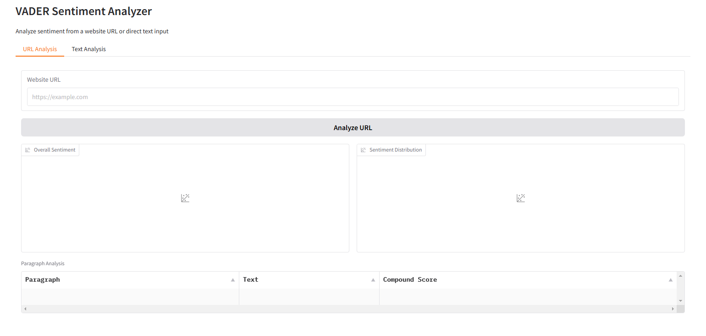
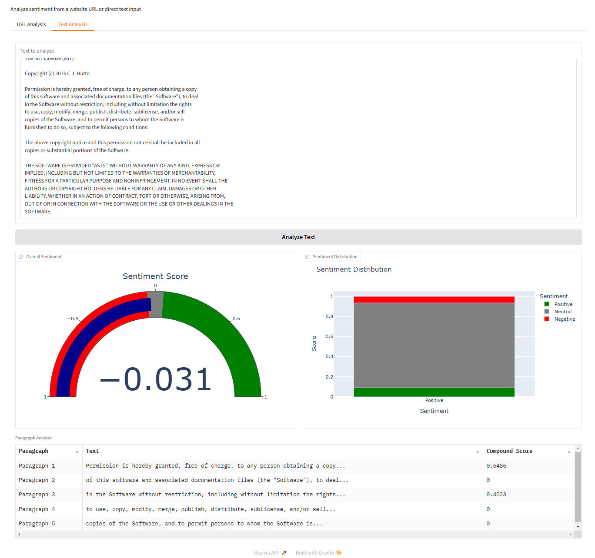
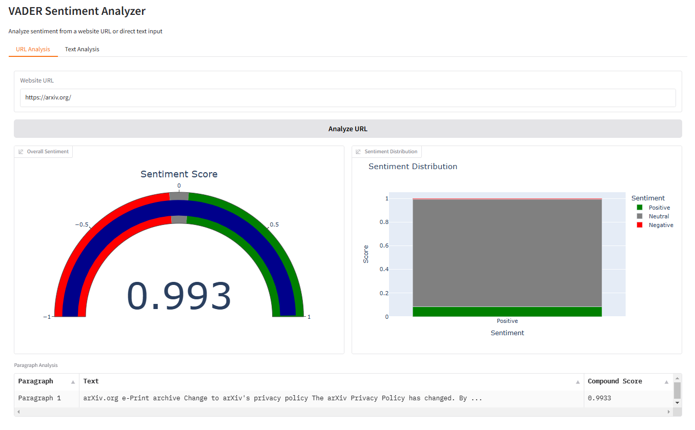

# VADER Sentiment Analysis UI

A web-based interface for VADER (Valence Aware Dictionary and sEntiment Reasoner) sentiment analysis, built with Gradio. This tool allows you to analyze the sentiment of both text input and web content.

## Dependencies

Core Dependencies:
- `gradio>=5.9.1` - Web interface framework
- `vaderSentiment` - Sentiment analysis engine
- `plotly` - Interactive visualization and charts
- `pandas` - Data manipulation and analysis
- `beautifulsoup4` - HTML parsing for URL analysis
- `requests` - HTTP requests for URL fetching

Additional Requirements:
- `numpy` - Numerical computations
- `markdown-it-py` - Markdown processing
- `jinja2` - Template engine for web interface
- `httpcore` - HTTP client
- `click` - Command line interface tools
- `uvicorn` - ASGI web server
- `rich` - Terminal formatting
- `huggingface-hub` - Model and component management
- `httpx` - HTTP client
- `typer` - CLI builder
- `safehttpx` - Secure HTTP client
- `gradio-client` - Gradio client utilities
- `fastapi` - Web API framework

Optional Dependencies:
- `python-multipart` - File upload handling
- `pyyaml` - YAML file processing
- `orjson` - Fast JSON processing
- `websockets` - WebSocket support
- `aiofiles` - Asynchronous file operations

## Python Version Requirements
- **Required**: Python 3.8 or higher
- **Recommended**: Python 3.9+ for optimal performance
- **Tested on**: Python 3.8, 3.9, 3.10, and 3.11

To check your Python version:
```bash
python --version  # Windows
python3 --version  # macOS/Linux
```

## Virtual Environment Setup

### Creating a Virtual Environment
It's recommended to run this project in a virtual environment to avoid conflicts with other Python packages.

### Windows
```bash
# Create a new virtual environment
python -m venv venv

# Activate the virtual environment
.\venv\Scripts\activate

# Verify activation (should show virtual environment path)
where python
```

### macOS/Linux
```bash
# Create a new virtual environment
python3 -m venv venv

# Activate the virtual environment
source venv/bin/activate

# Verify activation (should show virtual environment path)
which python
```

### Deactivation
When you're done, you can deactivate the virtual environment:
```bash
deactivate
```

### Version Compatibility Notes
- Python 3.8: All features supported
- Python 3.9+: Recommended for best performance
- Python 3.11+: Some dependencies may require specific versions
- Python 3.12: Limited testing, may require dependency updates

## Installation

### Core Dependencies
```bash
pip install gradio>=5.9.1 vaderSentiment plotly pandas beautifulsoup4 requests
```

### Additional Requirements
```bash
pip install numpy markdown-it-py jinja2 httpcore click uvicorn rich huggingface-hub httpx typer safehttpx gradio-client fastapi
```

### Optional Dependencies
```bash
pip install python-multipart pyyaml orjson websockets aiofiles
```

### All-in-One Installation
To install all dependencies (recommended):
```bash
pip install gradio>=5.9.1 vaderSentiment plotly pandas beautifulsoup4 requests numpy markdown-it-py jinja2 httpcore click uvicorn rich huggingface-hub httpx typer safehttpx gradio-client fastapi python-multipart pyyaml orjson websockets aiofiles
```

## Components

### 1. vader_ui.py
The main application that provides a web interface for sentiment analysis. Features include:
- Text analysis with direct input
- URL analysis for web content
- Visual sentiment scoring with gauges and charts
- Paragraph-by-paragraph sentiment breakdown
- Real-time analysis updates

To run the interface:
```bash
python vader_ui.py
```
Then open `http://127.0.0.1:7860` in your browser.

### 2. test_vader.py
Basic sentiment analysis test suite that verifies:
- Core VADER functionality
- Sentiment scoring accuracy
- Text processing capabilities
- Error handling

To run the tests:
```bash
python test_vader.py -v
```

### 3. test_vader_ui_components.py
Comprehensive UI component test suite that checks:
- Interface structure and layout
- Component properties and interactions
- Real-time updates and callbacks
- Input validation and error handling
- Concurrent analysis capabilities

To run the UI tests:
```bash
python test_vader_ui_components.py -v
```

## Features

### Text Analysis
- Direct text input analysis
- Sentiment scores (-1 to +1)
- Positive/Neutral/Negative distribution
- Paragraph-level breakdown

### URL Analysis
- Web content sentiment analysis
- HTML parsing and cleaning
- Full page sentiment overview
- Key section analysis

### Visualization
- Sentiment gauge charts
- Distribution bar charts
- Detailed data tables
- Real-time updates

## Usage Examples

### Text Analysis
```python
from vader_ui import analyze_text

# Analyze text
text = "This is a great example! I love it."
gauge, distribution, paragraphs = analyze_text(text)
```

### URL Analysis
```python
from vader_ui import analyze_url

# Analyze website
url = "https://example.com"
gauge, distribution, paragraphs = analyze_url(url)
```

## Interface Screenshots

### Main Interface

The main interface shows two tabs: one for text analysis and another for URL analysis. Each tab provides specific input options and visualization components.

### Text Analysis Example

Text analysis interface showing:
- Text input area
- Sentiment gauge showing overall score
- Distribution chart of positive/neutral/negative sentiments
- Paragraph-by-paragraph breakdown

### URL Analysis Example

URL analysis interface demonstrating:
- URL input field
- Website content sentiment analysis
- Visual sentiment indicators
- Detailed content breakdown

## Interpreting Results

### Sentiment Gauge
The sentiment gauge displays a compound score ranging from -1 (extremely negative) to +1 (extremely positive):
- **Positive sentiment**: Score ≥ 0.05
- **Neutral sentiment**: -0.05 < Score < 0.05
- **Negative sentiment**: Score ≤ -0.05

Example interpretations:
- 0.8 to 1.0: Very positive sentiment
- 0.3 to 0.7: Moderately positive
- -0.3 to 0.3: Neutral or mixed
- -0.7 to -0.3: Moderately negative
- -1.0 to -0.8: Very negative

### Distribution Chart
The bar chart shows the proportion of three sentiment categories:
- **Positive (Green)**: Percentage of positive words/phrases
- **Neutral (Gray)**: Percentage of neutral words/phrases
- **Negative (Red)**: Percentage of negative words/phrases

Key insights:
- High positive + low negative = Overall positive sentiment
- Similar positive and negative = Mixed or conflicting sentiment
- High neutral = Objective or factual content

### Paragraph Analysis Table
The table breaks down sentiment by paragraph:
- **Paragraph**: Sequential identifier
- **Text**: First 100 characters of the paragraph
- **Compound Score**: Individual sentiment score for that paragraph

Use this to:
- Identify sentiment shifts across the text
- Locate particularly positive/negative sections
- Understand sentiment flow and context

### Common Patterns

1. **Strong Agreement/Positivity**:
   - High compound score (> 0.5)
   - Large green bar in distribution
   - Consistent positive paragraph scores

2. **Strong Disagreement/Negativity**:
   - Low compound score (< -0.5)
   - Large red bar in distribution
   - Consistent negative paragraph scores

3. **Mixed Opinions**:
   - Neutral compound score (near 0)
   - Similar-sized green and red bars
   - Varying paragraph scores

4. **Objective Content**:
   - Neutral compound score
   - Large gray bar in distribution
   - Consistent neutral paragraph scores

### Special Cases

1. **Sarcasm and Irony**:
   - VADER may not catch subtle sarcasm
   - Look for contradicting paragraph scores
   - Consider context when interpreting

2. **Technical Content**:
   - Often appears more neutral
   - Domain-specific terms may be missed
   - Focus on clear sentiment indicators

3. **Multiple Languages**:
   - Best accuracy with English text
   - May underestimate sentiment in other languages
   - Consider using language-specific tools for non-English text

## Running Tests
To run all tests:
```bash
python -m unittest discover -v
```

To run specific test files:
```bash
python test_vader.py -v
python test_vader_ui_components.py -v
```

## License
MIT License - See LICENSE file for details 